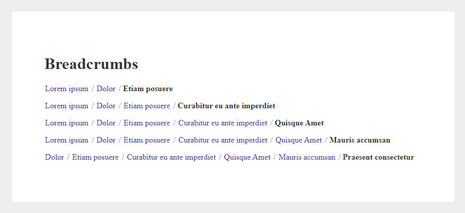
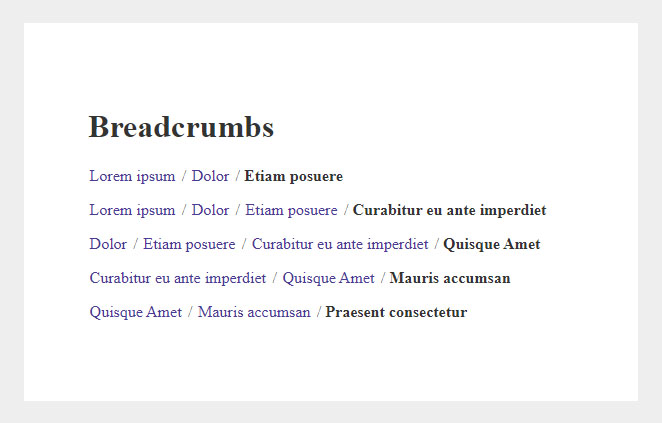
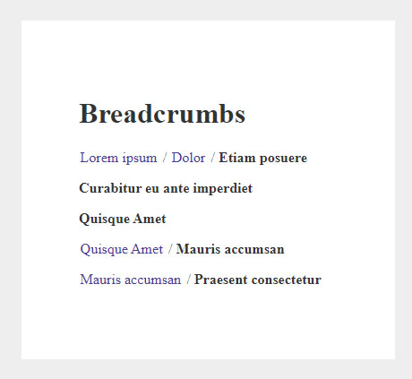
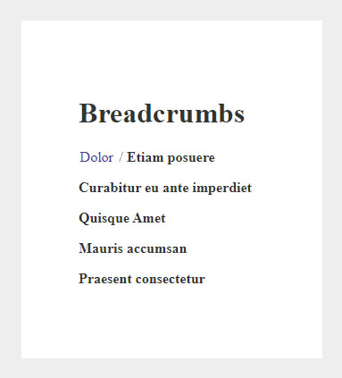

# Adaptive breadcrumb navigation

HTML, SCSS, JS, jQuery

Adaptive breadcrumb navigation that detects whether it fits in its window. If it does not fit in its window, it removes its elements from the left.

Browser width: 1030 px:

Browser width: 923 px:

Browser width: 662 px:

Browser width: 460 px:

Browser width: 383 px:

